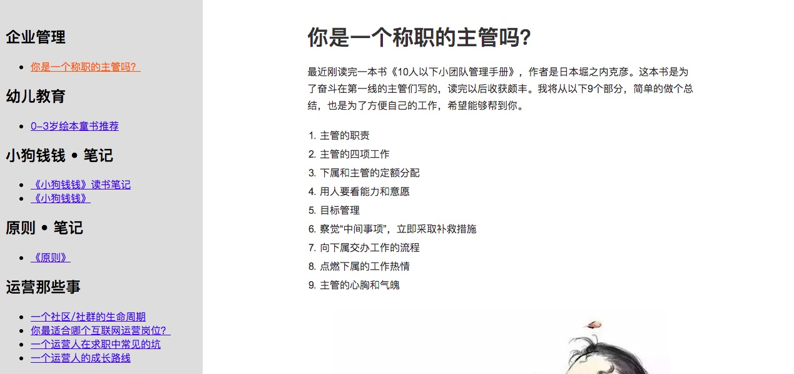

# 用 Puppeteer 实现简书文章备份
读了篇文章 [《前端使用 puppeteer 爬虫生成《React.js 小书》PDF并合并》](https://segmentfault.com/a/1190000016198363)。参照这个思路，可以用 [Puppeteer](https://github.com/GoogleChrome/puppeteer) 备份简书的文章。

呈现效果：


点击左侧的链接，可以看到每篇文章。每篇文章都存了一张截图，如下图所示：


## 实现思路
1. 进入个人首页，抓取该用户所有的文章。
2. 对每篇文章截图。
3. 生成一个导航页面。该页面上的链接，可以看到每篇文章截图。

## 主要的实现代码
抓取该用户所有的文章。需要程序将页面滚动到底部，去拿所有文章。代码如下：
```
let articles = await page.evaluate(async () => {
  // 将页面滚动到最底部
  await new Promise((resolve, reject) => {
    let totalHeight = 0
    let distance = 200
    let timer = setInterval(() => {
      let scrollHeight = document.body.scrollHeight
      window.scrollBy(0, distance)
      totalHeight += distance
      if(totalHeight >= scrollHeight){
        clearInterval(timer)
        resolve()
      }
    }, 100)
  })
  // 抓取所有文章
  var res = Array.from(document.querySelectorAll('.note-list a.title'))
                .map(link => {
                  return {
                    id: link.getAttribute('href').split('/').slice(-1),
                    title: link.textContent
                  }
                  
                })
  return res
})
```

对每篇文章截屏。
```
for(var i = 0; i < articles.length; i++) {
  await download(browser, articles[i].id)
}
```

加载文章中的图片，生成一个导航页面。该页面上的链接到每篇文章截图。
```
const imgs = Array.from(document.querySelectorAll('.show-content img'))
await Promise.all(imgs.filter(img => !img.complete).map(img => {
  return new Promise((resolve, reject) => {
    img.addEventListener('load', resolve);
    img.addEventListener('error', resolve); // 也算成功吧
  });
}))
```

下载某篇文章。
```
await page.screenshot({
  fullPage: true,
  path: resolve(outputConfig.path, `${pageInfo.title}.png`)
})
```

## 遇到的坑
### 图片懒加载
文章的图片是懒加载，因此直接截图，在页面不可见部分的图片会截不全。

解决方案：  
程序将页面往下每过一段时间往下滚，滚动到不能滚动为止。

### pfd 里插图片的问题
开始是想做一篇文章生成一个PDF，然后把所有的PDF再拼成一个PDF的。 但发现PDF插入图片，如果图片处于跨页位置或图片高度超过一页PDF的高度时，会自动裁切。效果不好，就放弃PDF了。

解决方案：  
用图片来做截屏。

### page.evaluate 不支持调用外部函数
解决方案：
用 `page.evaluateHandle` 添加方法。如果只是加外部的 `consle.log` 可以用  
```
page.on('console', msg => console.log(msg.text()))
```

### 反爬虫
短时间内频繁访问简书的文章，会触发简书反爬虫机制，导致返回的页面超时。

解决方案:
如果页面访问超时，歇一段时间，多试几次。

```
try {
  await page.goto(url)
} catch(e) {
  // 请求超时，重试3次。 为了反爬虫。
  await retry(3, async () => {
    await page.goto(url)
  })
}

async function retry(times, fn) {
  if(times > 0) {
    await timeout(1000) // 歇1秒再试
    try {
      await fn()
    } catch(e) {
      await retry(times--, fn)
    }
  }
}
```

